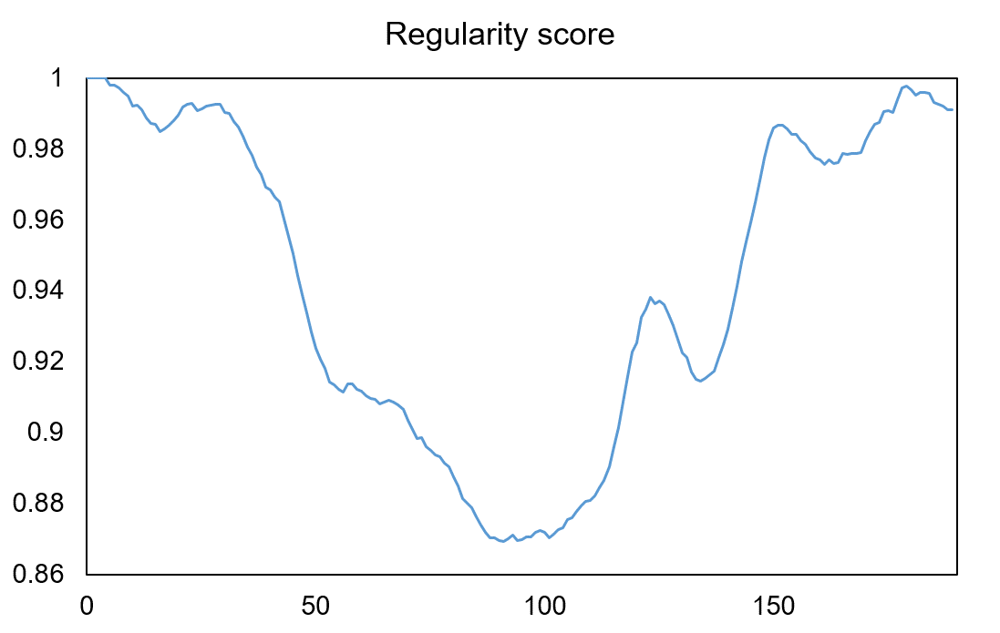

# ConvLSTMAutoEncoder

## Introduction

This is a PyTorch implementation of an anomaly detection in video using Convolutional LSTM AutoEncoder. This project is inspired by some articles below.
* Mahmudul Hasan, Jonghyun Choi, Jan Neumann, Amit K. Roy-Chowdhury, Learning Temporal Regularity in Video Sequences (2016), arXiv:1604.04574.
* Yong Shean Chong, Abnormal Event Detection in Videos using Spatiotemporal Autoencoder (2017), arXiv:1701.01546.

|  |  |
|---|---|
| Input image | result |

## Preresquisties
* PyTorch
* tqdm
* Albumentations
* NumPy

## How to train

* For training, you should get a sequence of video frames which contains 'normal' situations.
* It is a good way to see [UCSD Anomaly Detection Dataset](http://www.svcl.ucsd.edu/projects/anomaly/dataset.html) to get more details.
* Put a sequence and set your training phase at train.py

```
class args():
    # Dataset setting
    channels = 3
    size = 256
    frames_dir = 'datasets/train'
    time_steps = 10
```
where *time_steps* denotes each of size using the sliding window technique.
* Run the command below
```
python train.py
```

## How to evaluate
* Just run the command below
```
python evaluate.py
```
* Then, you can get regularity scores at each frame.

## Notes
* For convolutional LSTM with time-distributed convolutions, I refered to great works below
[PyTorch Forum](https://discuss.pytorch.org/t/timedistributed-cnn/51707/2)
[ndrplz's work](https://github.com/ndrplz/ConvLSTM_pytorch)
* You can see same results with Keras in [here](https://github.com/hashemsellat/Video-Anomaly-Detection)